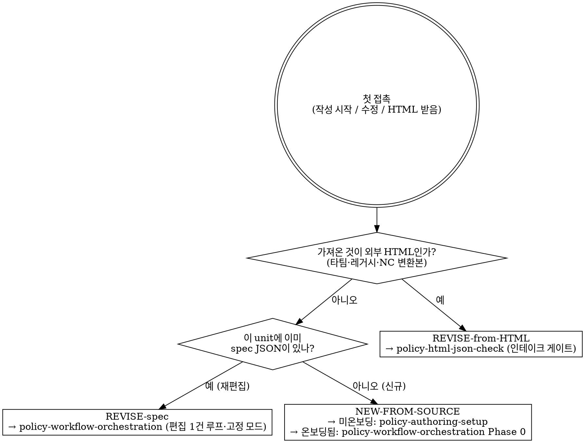

# 정책서 인테이크 라우터 (Policy Intake Router)

> **Claude/Codex에서**: 한 작성 단위(unit)를 막 시작할 때 가장 먼저 뜨는 스킬. 이 스킬은 **분류와 핸드오프만** 한다 — 실제 작업은 가리키는 형제 스킬이 한다. `policy-*` 스킬을 함께 설치하면 핸드오프가 완전해진다.

작성 단위와의 **첫 접촉**에서 "지금 무엇을 하려는가"를 **세 진입 경로 중 하나로 분류**하고 알맞은 시작 스킬로 넘긴다. 핵심 규율: **라우터는 워크플로우를 소유하지 않는다** — 분류한 뒤 즉시 핸드오프하고, 다운스트림 작업(빌드·PI 작성·렌더)은 형제 스킬에 맡긴다.

> **왜 필요한가**: 첫 접촉은 "새로 만드나? 기존 걸 고치나? 받은 HTML을 들이나?"가 섞여 들어온다. 분류 없이 바로 손대면 잘못된 경로(예: 외부 HTML을 진실원천으로 덮어쓰기, 완주한 unit을 처음부터 재작성)로 샌다. 이 스킬이 그 갈림길만 정확히 잡는다.

---

## 언제 (When to Use)
- **첫 접촉 1회만** — 작성 단위를 처음 열거나, 무엇부터 할지 정해지지 않았을 때.
- 신호: "정책서 작성 시작", "새 모듈/새 unit", "기존 정책서 수정해줘", "이 HTML 받았는데 어떻게", "뭐부터 해야 돼".

## 언제 안 쓰나 (When NOT to Use — 음성)
- **이미 경로가 정해져 작업 중**이면 재트리거 금지. Phase 진행 중("빌드해줘", "이 PG 정책 상세 써줘", "감사 돌려줘", "렌더해줘")은 라우터가 아니라 해당 phase 스킬이 받는다.
- 중간 단계 어휘(빌드·감사·렌더·applies_to·field_review·splice·G2/G5)는 **분류 신호가 아니다** — 이미 분류가 끝난 상태다. 라우터를 다시 부르지 말고 `policy-workflow-orchestration`의 편집 1건 루프로 간다.

## 결정 트리 (분류 → 핸드오프)

> **신호가 섞이면 트리로 단정하지 말 것**: 외부 HTML과 기존 spec이 동시에 있으면 트리상 `q_html=예`로 가지만, 이때는 강행하지 말고 **핸드오프 규율 #3**(사용자에게 어느 쪽이 진실원천인지 확인)으로 간다.

## 세 진입 경로 (분류표)

| 경로 | 신호 | 핸드오프 대상 | 넘기기 전 라우터의 첫 확인 |
|---|---|---|---|
| **NEW-FROM-SOURCE** | spec 없음 + 소스 보유(NC 자동초안·as-is 문서·구조화 데이터·처음부터) | 미온보딩 → `policy-authoring-setup`(배선·config·스키마) / 온보딩됨 → `policy-workflow-orchestration` Phase 0(`convert_autodraft`) | 소스 형식 (a)구조화 (b)as-is만 (c)처음부터 (d)NC 자동초안 중 무엇인지 식별 |
| **REVISE-from-HTML** | "이 HTML 받았어"(타팀·레거시·NC 변환본을 파이프라인에 들임) | `policy-html-json-check`(인테이크 게이트·사용자 확인 후 조건부 복원) | ⚠️ **HTML이 자동으로 진실원천 아님** — 복원 전 반드시 묻는다 |
| **REVISE-spec** | 이미 완주/진행 중인 spec JSON을 재편집 | `policy-workflow-orchestration`(편집 1건 루프) | **고정 모드**: FN 레이어·명칭·applies_to·PI group_id는 고정, 값 확정/배지 제거만 |

> NEW-FROM-SOURCE에서 소스가 **외부 HTML**이면 그건 REVISE-from-HTML 경로다(HTML은 항상 P2 인테이크 게이트를 거친다). "처음부터(scratch)"·NC 자동초안(JSON)은 HTML이 아니므로 NEW 경로.

## gap-fill 오버레이 (경로 무관 — PI 내용 채울 때 항상 적용)
어느 경로로 들어왔든 정책 상세(PI) 값을 채우는 순간 아래 가드가 켜진다. 라우터는 이 기본값을 핸드오프 시 명시한다:
- **P3 = 제로추론 기본(default)**: 모든 값은 근거로 추적되는 사실. 불확실하면 만들지 말고 플래그. → `policy-detail-authoring`.
- **P4 = field_review 붉은 배지**: 시스템 이관 미확정·to-be 미정 값은 "현업 검토 필요" 붉은 배지로 표면화.
- **P5 = 일반정책 추론 = opt-in**: 통신·글로벌 앱/웹 일반 관행 추론은 **사용자 명시 요청 시에만**. 켜더라도 **항상 확인 + 붉은 배지 + 근거 1줄**. 무요청 자동일반화 금지(P3 제로추론을 약화하지 않는다).

## 핸드오프 규율 (절대)
1. **분류 즉시 핸드오프** — 라우터는 경로를 정하고 "→ `<스킬>`로 넘깁니다" 한 줄로 끝낸다. 빌드·작성·렌더를 라우터에서 시작하지 않는다.
2. **첫 접촉 1회** — 핸드오프 후 동일 unit에서 다시 트리거되지 않는다(이후는 orchestration이 phase를 돌린다).
3. **불명확하면 묻는다** — 세 경로 신호가 섞이면(예: "HTML도 있고 기존 spec도 있음") 한 가지만 골라 강행하지 말고 사용자에게 어느 쪽이 진실원천인지 확인한다.

## 다른 스킬과의 연계
- 신규 배선·config·스키마 → `policy-authoring-setup`.
- 전체 phase 시퀀스·편집 1건 루프 → `policy-workflow-orchestration`(미분류 첫 접촉이면 이 라우터가 먼저).
- 외부 HTML↔JSON 사전 검토·조건부 복원 → `policy-html-json-check`.
- PI 본문·팩트체크·field_review·일반정책 opt-in → `policy-detail-authoring`.
